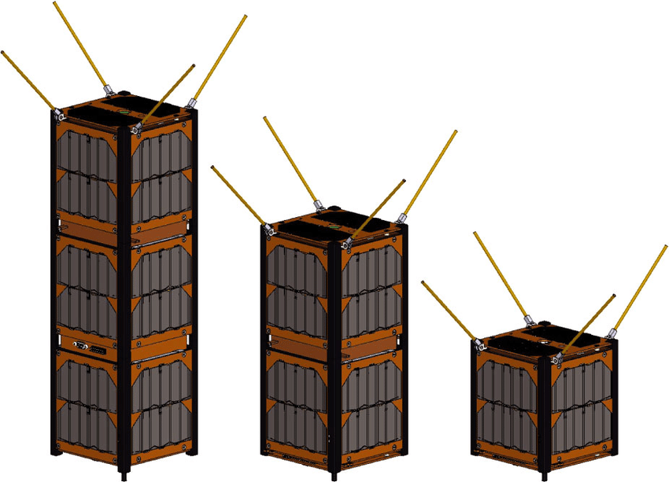

Прогресс в миниатюризации добрался и до космоса. Сегодня огромные и дорогие аппараты все чаще дополняются или заменяются **орбитальными группировками из маленьких и дешевых спутников.** Самый популярный стандарт среди них — это **кубсаты (CubeSats)**.

#### Что такое кубсат?

**Кубсат** — это малый спутник, базовый модуль которого представляет собой куб со стороной всего **10 см** (этот размер называется **1U**). Как конструктор Lego, эти модули можно комбинировать, создавая более крупные аппараты форматов **3U, 6U** и так далее.

#### В чем их главные преимущества?

1. **Стандартизация:** Жесткие ограничения по размеру и весу упрощают и удешевляют производство, испытания и, что ключевое, **запуск**. Их можно запускать "попутным грузом" с большими спутниками или просто выкинуть с МКС.
    
2. **Дешевизна:** Создание и запуск кубсата в разы дешевле, чем традиционного аппарата. Это открывает дорогу в космос университетам, небольшим компаниям и стартапам.
    
3. **Доступность:** Они позволяют быстро и с минимальным риском tested новые технологии, научные приборы или инженерные решения перед тем, как установить их на дорогие миссии.
    

#### Где они применяются?

- **Наука и образование:** Проведение экспериментов в условиях микрогравитации. Идеальный инструмент для вузов.
    
- **Отработка технологий:** Космический "полигон" для испытания новых датчиков, материалов систем связи.
    
- **Связь и мониторинг Земли:** Построение орбитальных группировок для обеспечения глобального интернета или съемки Земли с низких орбит.
    

#### А в чем же недостаток?

Их главное достоинство — малый размер — является и их главным ограничением.

- **Мало места:** Очень сложно уместить в такой tiny объем полноценные системы (мощные передатчики, систему охлаждения, большие антенны или телескопы).
    
- **Ограниченный ресурс:** Часто у них нет двигателей для коррекции орбиты, поэтому их век недолог — они относительно быстро сходят с орбиты и сгорают в атмосфере.
    

**Вывод:** Кубсаты не заменят полностью крупные спутники для сложных миссий к другим планетам. Но они совершили революцию, **демократизировав доступ в космос**, сделав его быстрым, массовым и доступным для самых разных задач на околоземной орбите.

>[!example] Пример использования
>Частная американская компания [Planet Labs](https://ru.wikipedia.org/wiki/Planet_Labs) - мировой лидер в области съемки Земли. Их группировка состоит из **сотен кубсатов** формата **3U** (например, серия _Dove_). Они ежедневно делают снимки всей поверхности планеты, что позволяет отслеживать изменения в сельском хозяйстве, строительстве, последствия стихийных бедствий в почти реальном времени.