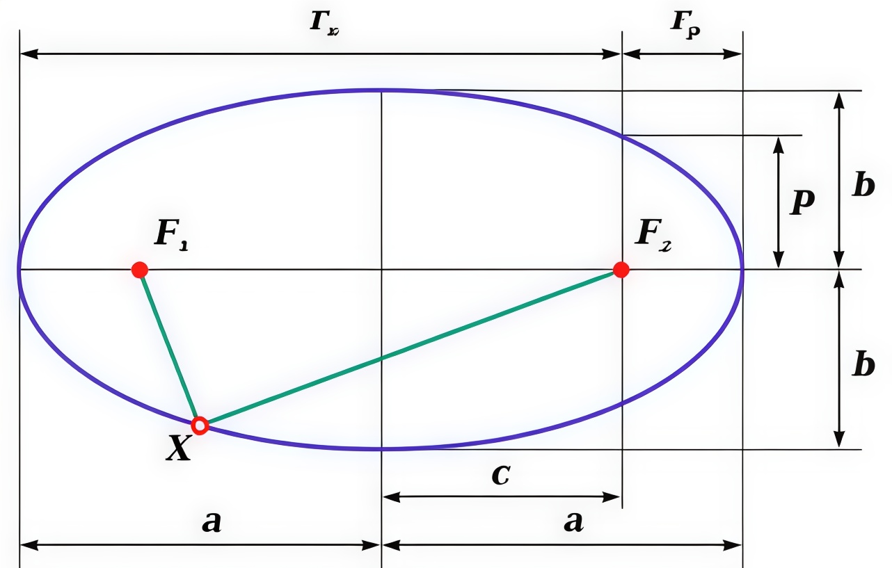
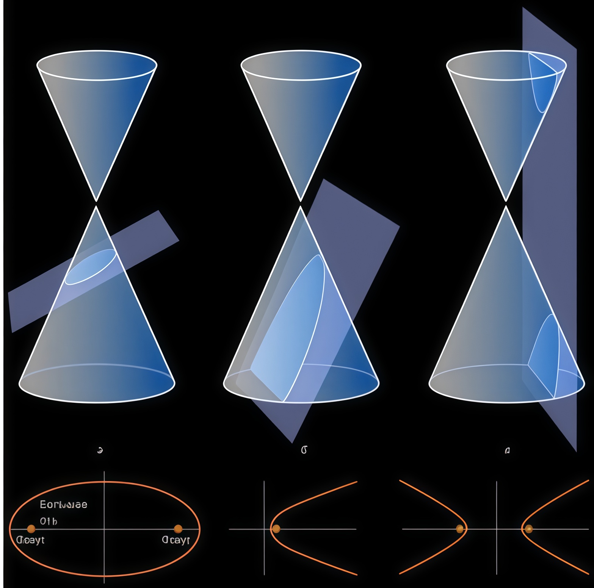
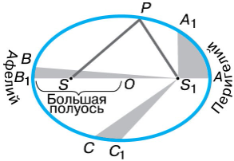

Космические спутники решают множество задач, которые часто можно было бы выполнить и с Земли (например, с помощью авиации или вышек). Но их ключевое преимущество — **способность долго двигаться с нужной скоростью на нужной высоте, почти не тратя топлива**. Эту уникальную возможность диктуют **законы небесной механики**, открытые очень давно.

## Первый закон Кеплера

Представьте, что у вас есть самый главный секрет Вселенной. Ну, например, инструкция о том, как планеты движутся вокруг Солнца. Эту инструкцию — три правила, или **законы Кеплера** — в начале 17 века отыскал немецкий астроном-бунтарь **Иоганн Кеплер**.

До него все умные люди были уверены, что планеты летают по идеальным кругам — это же так красиво и логично! Но Кеплер, как настоящий детектив, изучил записи своего наставника Тихо Браге и обнаружил нестыковку. Следы вели не к окружности, а к другой фигуре.

Он буквально **взломал код движения планет**, наблюдая за Марсом и Землёй. И оказалось, что орбита — это не круг, а **эллипс** (представьте немного вытянутый круг, как будто на мяч сели сверху). А Солнце при этом находится не в центре, а в одном из фокусов этого эллипса (как будто смещённый центр тяжести). Позже он понял, что это правило работает не только для планет, но и для всего на свете: спутников, астероидов и даже запущенных нами космических аппаратов!

>[!example] **Первый закон Кеплера** 
>_Под действием силы притяжения одно небесное тело движется в поле тяготения другого небесного тела по одному из конических сечений - кругу, эллипсу, параболе или гиперболе._

Иными словами, орбиты небесных тел являются эллипсами, параболами или гиперболами. Давайте для начала вспомним, что такое эллипс.

### Что же такое эллипс?

Итак, Первый закон Кеплера говорит нам, что орбиты — это эллипсы. Но что это вообще такое? Давай представим не идеальный круг, а скорее **«сплюснутый» круг**, похожий на овал или на траекторию качелей, которые раскачали не до конца.

У каждого эллипса есть два особых пункта притяжения — **фокусы** (на картинке это точки F₁ и F₂). В случае с планетой, вращающейся вокруг Солнца, **Солнце всегда находится в одном из этих фокусов!**

**Главное правило эллипса:** если взять любую точку на этой кривой, сложить расстояния от неё до обоих фокусов, то эта сумма **всегда будет одинаковой** и равной длине большой оси. Это как если бы у тебя была верёвочка, прикрепленная на два гвоздика (фокусы). Рисуя мелом, натянув верёвочку, ты получишь идеальный эллипс!

Чтобы понять, насколько эллипс похож на круг или, наоборот, вытянут, учёные придумали специальный параметр — **эксцентриситет (e)**.
$$
e=\sqrt{ 1-\frac{b^2}{a^2} },
$$

где $a$ и $b$ - большая и малая полуоси эллипса.

- **e = 0:** Это и есть идеальный **круг**! Оба фокуса сливаются в одну точку в центре.
    
- **0 < e < 1:** Это и есть наш **эллипс**. Чем ближе эксцентриситет к единице, тем более вытянутым и «сплющенным» он будет.
    
- **e = 1:** Это уже **парабола** — незамкнутая кривая. Тело с такой орбитой улетит от звезды и никогда не вернётся.
    
- **e > 1:** Это **гипербола**. Такую траекторию имеют некоторые кометы, прилетающие из далёкого космоса. Они один раз обогнут Солнце и улетят навсегда.

### Точки максимального сближения и удаления: Перигей и Апогей

На любой орбите есть две ключевые точки:

- **Перицентр (Periapsis)** — ближайшая к центру притяжения точка орбиты. Расстояние до неё называется **перифокусное ($r_p$​)**.
    
- **Апоцентр (Apoapsis)** — самая дальняя точка орбиты. Расстояние до неё называется **апофокусное ($r_a$​)**.
    

Линия, которая соединяет эти две точки, — это и есть главная ось эллипса, его «самая длинная рулетка». Она называется **линия апсид**.

Но эти точки называются по-разному, в зависимости от того, вокруг кого ты вращаешься. Это как секретный код космонавтов:

- **Вокруг Солнца (греч. «Гелиос»)?** Тогда **Перигелий** и **Афелий**.
    
- **Вокруг Земли (греч. «Гея»)?** Это **Перигей** и **Апогей** (именно эти термины мы используем для спутников).
    
- Вокруг Луны? Периселений и апоселений. Вокруг другой звезды? Свои названия.
    

>Запомнить просто: **«Пери-»** значит «близко», **«Апо-»** значит «далеко». А вторая часть слова указывает на объект притяжения.

%%
**Совет**. Учащимся можно дать задание найти в открытых источниках информации названия апоцентра и перицентра для спутников Солнца, Луны, Марса и, по возможности, других тел Солнечной системы._
%%

## Второй закон Кеплера

Кеплер не остановился на том, _какая_ форма у орбиты. Его гениальный ум подметил _как_ именно планета движется по этому эллипсу. Оказалось, что **скорость планеты постоянно меняется**!

Планета несётся like a rollercoaster: она **ускоряется**, когда приближается к Солнцу (в перигелии), и **замедляется**, когда достигает самой далёкой точки (афелия). Почему так происходит?

С точки зрения современной физики, всё объясняет **[[../Теория/ЗаконСохранения|закон сохранения энергии]]**. Представьте, что вы скатываетесь на скейте с рампы:

- Наверху (далеко от Солнца) ваша **потенциальная энергия** максимальна, а скорость (**кинетическая энергия**) мала.
    
- Внизу (близко к Солнцу) потенциальная энергия превратилась в кинетическую, и вы летите с огромной скоростью!
    

Так же и планета: её полная энергия постоянна, поэтому она «распределяет» её между скоростью и удалённостью.

Кеплер описал это красивым и точным правилом:

>[!example] **Второй закон Кеплера** 
>_За равные промежутки времени планета “ометает” равные площади._

**Что это значит на простом примере?**  

Посмотрите на рисунок. Планета проходит отрезки $AA_1$, $BB_1$ и $CC_1$ за одно и то же время (например, за 30 дней). Кеплер обнаружил, что площади образовавшихся «кусочков пирога» ($A_1AS_1$, $B_1BS_1$, $C_1CS_1$) будут **равны**.

Чтобы за одно и то же время «омести» такую же площадь на окраине орбиты (где сектор длинный, но узкий), планете приходится двигаться **медленнее**. Ближе к Солнцу, чтобы покрыть такую же площадь (где сектор короткий, но широкой), она должна нестись **гораздо быстрее**.

>Нам даже не нужно смотреть на другие планеты, чтобы в этом убедиться. **Зимой** Солнце проходит по небу **быстрее**, а дни короче. А **летом** оно движется **медленнее**, и дни длиннее. Это прямое следствие Второго закона Кеплера! Выходит, **зимой Земля находится ближе к Солнцу** (в перигелии), а летом — дальше (в афелии).

### Практика: Расчет орбиты спутника

Давай применим знания о форме орбиты к реальной задаче, с которой сталкиваются инженеры-спутникостроители.

>[!example] Задача
>Мы запускаем спутник! Известны:
>- Высота в **перигее** (самой низкой точке) = $h_π$
>- Высота в **апогее** (самой высокой точке) = $h_α$
>- Радиус Земли $R_З$
>
>![[../images/Pasted image 20250909112310.png|Эллиптическая орбита спутника]]
>
>Найдите **большую полуось орбиты** ($a$) нашего спутника. Это ключевой параметр, определяющий размер и период обращения орбиты.
>
>>[!help]- Подсказка
>>
>>1. Высота измеряется от поверхности, а для расчётов нужны расстояния от **центра Земли**. Не забудь это учесть!
>>2. Большая полуось эллипса ($a$) — это **полусумма** расстояний от центра до перигея и апогея. Логично, ведь это среднее значение между самой дальней и самой близкой точкой.
>
>>[!done]- Решение
>>
>>**Шаг 1.** Найдём расстояния от центра Земли до спутника.
>>- В перигее: $d_π = R_З + h_π$
>>- В апогее: $d_α = R_З + h_α$
>>
>>**Шаг 2.** Большая полуось $a$ — это среднее геометрическое наибольшего и наименьшего расстояний:
>>$$a=\frac{d_π+d_α}{2}$$
>>**Шаг 3.** Тогда, подставляем наши выражения из Шага 1:
>>$$ a=\frac{R_З+h_π+R_З+h_α}{2}=\frac{2R_З+h_π+h_α}{2} $$
>>В итоге получаем:
>>$$ a=R_З+\frac{h_π+h_α}{2} $$
>>
>>Мы только что вывели формулу, которой пользуются настоящие инженеры для расчёта орбит. Получилось, что большая полуось — это радиус Земли плюс _средняя высота_ полёта спутника.

## Третий закон Кеплера

Первые два закона Кеплера описывают, как движется _одна_ планета. Но Иоганн Кеплер был уверен, что во Вселенной должен существовать единый **ритм**, который связывает движения _всех_ планет вместе. Он искал эту гармонию больше 10 лет и, наконец, нашёл её! Это стал его третий и, пожалуй, самый масштабный закон.

>[!example] **Третий закон Кеплера** 
>_Квадраты периодов обращений планет относятся друг к другу как кубы больших полуосей их орбит._
>
>**Звучит сложно? Давай расшифруем:**
>
>$$\dfrac{T^2_{1}}{T^2_{2}}=\dfrac{a^3_{1}}{a^3_{2}}, $$
>где:
>- $T_1$​ и $T_2$​ — это периоды планет (например, время, за которое они делают полный круг вокруг Солнца).
>- $a_1$​ и $a_2$​ — **большие полуоси** их орбит.

**Что это значит на практике?**  

Чем дальше планета от Солнца, тем **медленнее** она движется и тем **дольше** длится её год. Но это не просто «дальше = дольше». Зависимость здесь жёсткая и математически точная.

> **А при чём тут наши спутники?**
> Всё просто: **Третий закон Кеплера работает для любого тела, вращающегося вокруг другого**. Для спутника Земли он выглядит так:
> 
> *Квадрат периода обращения спутника вокруг Земли пропорционален кубу большой полуоси его орбиты.*
>
> Хочешь, чтобы спутник:
> - **Быстро облетал Землю за 90 минут?** (Низкая околоземная орбита) — сажай его на орбиту с малой полуосью.
> - **Висел над одной точкой планеты 24 часа?** (Геостационарная орбита) — тебе нужна орбита со строго определённой большой полуосью (~42 000 км).

### Практика: считаем год на Марсе

Третий закон Кеплера — это не просто теория. Это мощный инструмент, который позволяет нам, зная расстояние до планеты, вычислить длину её года, и наоборот. Давай проверим это на примере Земли и Марса.

> [!example] Задача
> 
> Известно, что большая полуось орбиты **Марса** ($a_2$) примерно в **1,524 раза больше**, чем у **Земли** ($a_1$). Год на Земле ($T_1$) длится **~365,25 дней**.
> 
> **Вопрос:** Используя Третий закон Кеплера, рассчитайте, сколько земных дней длится год на Марсе ($T_2$).
>
>>[!done]- Решение
>>
>>**Шаг 1.** Запишем преобразованную формулу:  
>>$$T^2_2=T^2_1⋅\dfrac{a^3_2}{a^3_1}$$
>>
>>**Шаг 2.** Выразим отношение полуосей через данное число: 
>>$$ \dfrac{a_2}{a_1}=1,524 \qquad \Rightarrow \qquad \dfrac{a^3_2}{a^3_1} = (1,524)^3$$ 
>>
>>**Шаг 3.** Подставим известные значения в формулу. $T_1$ — это период Земли (1 год). Для простоты расчётов будем считать его равным 1. Тогда $T^2_1 = 1$.  
>>
>>$$ T^2_2=1\cdot 3,54 $$
>>$$T_2=\sqrt{3,54} ≈ 1,88 \text{ }(земных\text{ }лет)$$
>>
>>**Шаг 4.** Переведём земные годы в дни:  
>>$$ 1,88\cdot 356,25 ≈ 687 \text{ } дней$$
>>
>>**Ответ:** Год на Марсе длится **примерно 687 земных дней**.

Эта формула — основа для расчётов всех космических миссий. Когда инженеры отправляют зонд к Марсу, они используют Третий закон Кеплера, чтобы точно рассчитать, где будет находиться планета через несколько месяцев полёта, и выбрать правильную траекторию для встречи с ней.

---

Именно эти точные математические расчёты Кеплера позже помогли **Исааку Ньютону** открыть **закон всемирного тяготения**. Фактически, Кеплер дал Ньютону готовые «подсказки» о том, как ведёт себя гравитация. Так законы движения планет положили начало целой науке — **небесной механике**.

